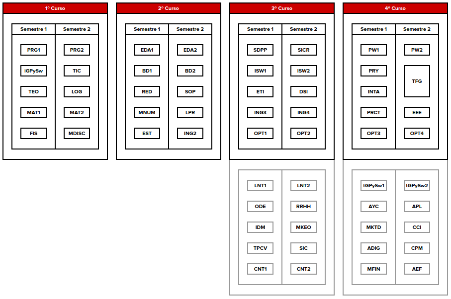

#  Modifica de Informática 2023

## Contexto

[Plan de estudios](https://www.uneatlantico.es/escuela-politecnica-superior/estudios-grado-oficial-en-ingenieria-informatica) del grado en informática

|Dónde estamos|Adónde queremos llegar|
|-|-|
|

## 2DOs académicos

|Qué hacer|Estado|
|-|-|
Introducir asignatura de [Arquitectura de Software](./ASW.md)|
Cambiar el nombre de "Introducción a la gestión de proyectos de software" por "Fundamentos de proyectos de software"|Discutido con LF
[Organizar el hilo FPSW / ISW1 / ISW2 / ASW](./organizarHilo.md)|
[Unificar asignaturas de Matemática Discreta y Lógica](./unificarMDisLog.md)|Visto con JC y JB
[Verificar instrumentos de evaluación y actividades](./evaluacionesInformatica.md)|
