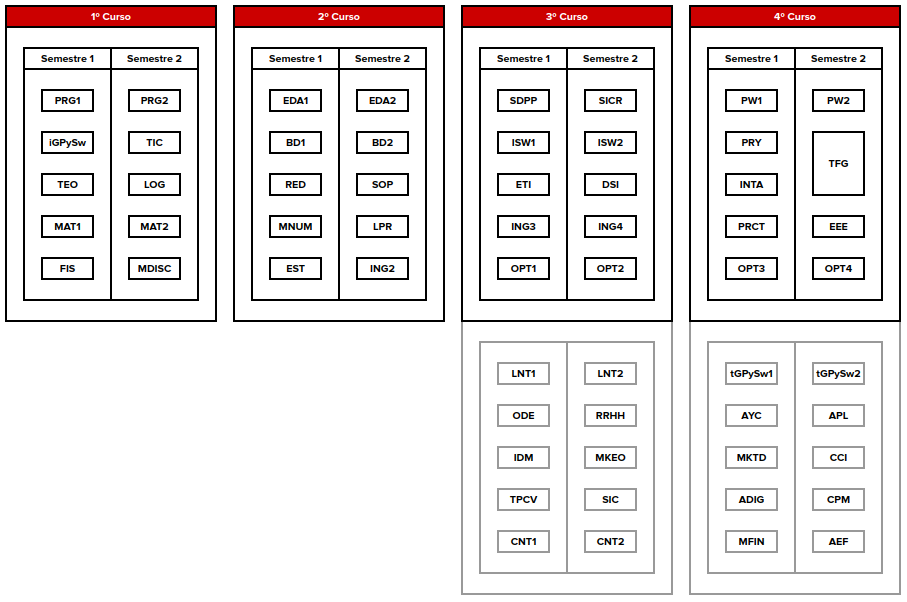

#  Modifica de Informática 2023

## Contexto

[Plan de estudios](https://www.uneatlantico.es/escuela-politecnica-superior/estudios-grado-oficial-en-ingenieria-informatica) del grado en informática

[Mapa MODIFICA](https://docs.google.com/spreadsheets/d/1-mqFmilP7UE53LjRsCL36k2CI5Ssm5v_9HyBy9uLVG0/edit?usp=sharing)

|Dónde estamos|Adónde queremos llegar|
|-|-|
|

## Materias y asignaturas

Organización del grado por materias, según la matriz de `gII2025.xlsx`:

| Materia | Asignaturas | ECTS |
|---|---|---|
| Fundamentos físicos de la informática | Física | 6 |
| Fundamentos matemáticos de la informática | Mat I, Mat II, M. discreta, M. numérica, Estadística, Lógica | 36 |
| Programación | Prog I, Prog II, EDA1, EDA2, Lenguajes de programación, PW1, PW2 | 42 |
| Ingeniería del software, SI y sistemas inteligentes | FPSW, TIC, BD1, BD2, ISW1, ISW2, ASW, DSI, IA, Proyectos | 60 |
| Ingeniería de ordenadores | Tecnología y estructura de ordenadores | 6 |
| Sistemas operativos, sistemas distribuidos y redes | Redes, SO, SDPP, Seguridad informática | 24 |
| Ética, legislación y profesión | Ética y legislación informática | 6 |
| Gestión de organizaciones | Economía de la empresa y emprendedores | 6 |
| Inglés | Inglés III, Inglés IV | 12 |
| Sistemas de información (opt.) | Investigación de mercados, Marketing estratégico, Marketing digital, Comunicación corporativa | 24 ofertados |
| Dominios de aplicación de la informática (opt.) | Contabilidad I, Contabilidad II, Matemáticas financieras, Análisis de estados financieros | 24 ofertados |
| Informática industrial (opt.) | Organización de empresas, Recursos humanos, Automática y control, Admin. producción y logística | 24 ofertados |
| Visualización y sistemas multimedia (opt.) | Teoría y práctica de la comunicación visual, Sociedad de la información, Animación digital, Creación de productos multimedia | 24 ofertados |
| Tópicos avanzados de tecnología y proyectos de software (opt.) | Lab. nuevas tendencias I y II, Taller GPS I y II | 24 ofertados |
| Prácticas Académicas Externas | Prácticas | 6 |
| Trabajo Fin de Grado | TFG | 12 |

> - Las 9 materias básicas & obligatorias suman 198 ECTS. Junto con Prácticas (6) y TFG (12) son 216.
> - El alumno cursa además 24 ECTS de optativas (4 asignaturas de las 20 ofertadas) para un total de 240 ECTS. La oferta optativa total es de 120 ECTS.

La jerarquía completa del RD 822/2021 es de tres niveles: módulo > materia > asignatura. Las materias son la organización propia del grado; los módulos BOE son bloques de créditos y competencias, y la adscripción de asignaturas a módulos se hace una a una.

## Conformidad con el BOE 2026 (título habilitante)

La Resolución BOE-A-2026-10594 abre la vía para que el grado obtenga carácter habilitante (profesión regulada de Ingeniero Técnico en Informática) si el plan se ajusta a la estructura de su Anexo II. Diagnóstico del plan con la modifica en curso, mención elegida **Ingeniería del Software**:

| Módulo BOE (Anexo II) | ECTS exigidos | ECTS asignados | Estado |
|---|:-:|:-:|---|
| Formación básica | 60 | 60 | Conforme |
| Común a la rama de informática | 60 | 60 | 4 lagunas formales argumentables |
| Tecnología específica — Ingeniería del Software | 48 | 48 | Conforme (6/6 competencias) |
| Trabajo Fin de Grado | 12 | 12 | Conforme |
| Resto (optativas, prácticas, otros obligatorios) | — | 60 | N/A |

- El plan cumple la estructura exigida sin crear asignaturas nuevas más allá de ASW, que el modifica ya incorpora. 
- Las cuatro lagunas del módulo común (C9, C16, C2, C3) se resuelven por argumentación de cobertura cruzada entre módulos; solo C3 (negociación, liderazgo, comunicación) requiere acción, añadiendo un resultado de aprendizaje explícito a una asignatura del común.
- El cambio de fondo en la memoria es documental: invertir el campo "Habilita para profesiones reguladas" a Sí y declarar la mención con sus 8 asignaturas.

Análisis completo, competencia a competencia: [ModificaVsBOE2026.md](ModificaVsBOE2026.md)